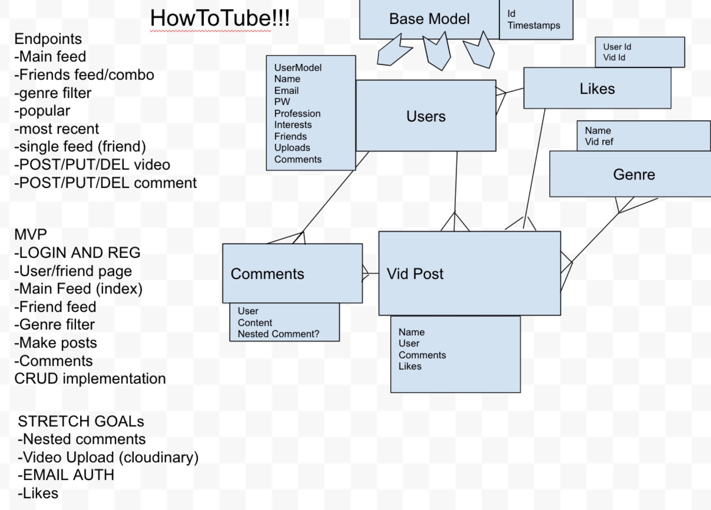
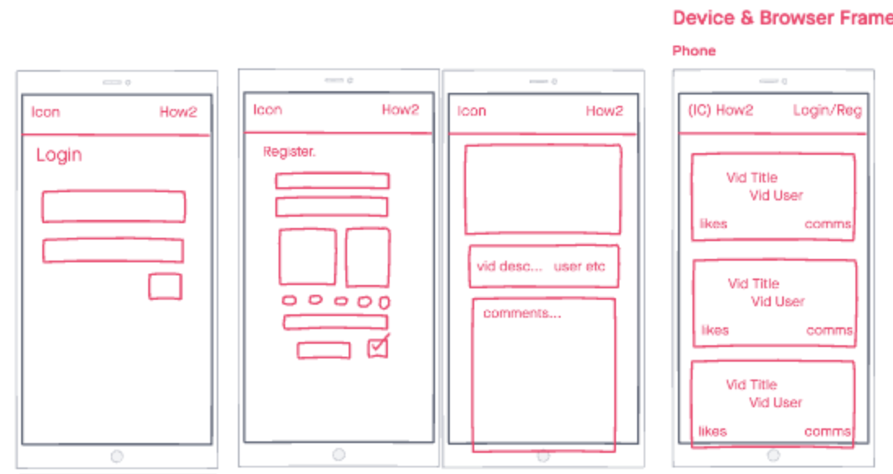
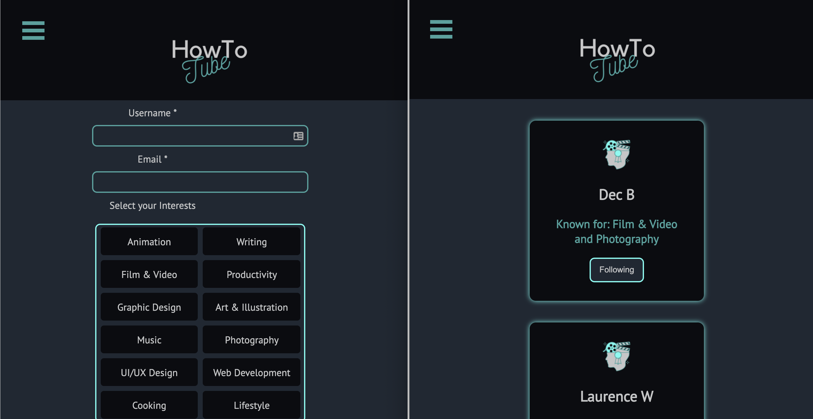
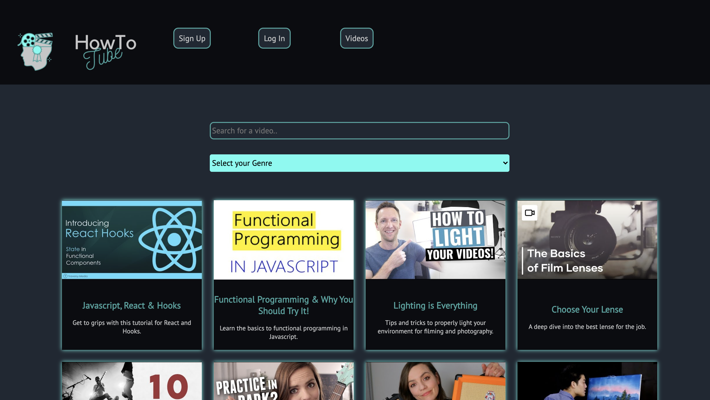

#  

### General Assembly Software Engineering Immersive

# Project-4 - PostgreSQL, Python, Flask & React Full Stack Application - HowToTube, A Video Platform for Personal Development!
### By [Laurence 🍳](https://github.com/ProDigresser) and Co-Contributors- [Sherryll 🎸](https://github.com/Selliott456) & [Dec 📷](https://github.com/dec1992).
 

         /__/\         /  /\         /__/\                 ___        /  /\    
         \  \:\       /  /::\       _\_ \:\               /  /\      /  /::\   
          \__\:\     /  /:/\:\     /__/\ \:\             /  /:/     /  /:/\:\  
       __ /  /::\   /  /:/  \:\   _\_ \:\ \:\           /  /:/     /  /:/  \:\ 
     /__/\  /:/\:\ /__/:/ \__\:\ /__/\ \:\ \:\         /  /::\    /__/:/ \__\:\
     \  \:\/:/__\/ \  \:\ /  /:/ \  \:\ \:\/:/        /__/:/\:\   \  \:\ /  /:/
      \  \::/       \  \:\  /:/   \  \:\ \::/         \__\/  \:\   \  \:\  /:/ 
       \  \:\        \  \:\/:/     \  \:\/:/               \  \:\   \  \:\/:/  
        \  \:\        \  \::/       \  \::/                 \__\/    \  \::/   
         \__\/         \__\/         \__\/                            \__\/    

## The Overview

This project was a Group Programming task - set as part of the Software Engineering Immersive Course from General Assembly.

This task involved working together to develop a Full Stack application using the core technologies of - PostgreSQL, Python, Flask and React. This Project took place over 6 working days. Whilst we are all familiar with React and JavaScript - SQL databases and Python & Flask are new technologies to us - so this was both a practicing and learning experience. 

When consulting as part of a team, it was decided to design an app to do with learning. What we came up with was a streaming platform app that allowed users to post Videos and comments, follow other users and view videos based on personal interests.

Find it here! --> [HowToTube 🤖](https://howtotube.herokuapp.com/)

### The Brief

- Collaborative development using Git and GitHub
- Develop a Full Stack Application
- Build a database and store information to it using PostgreSQL
- Navigate the database using Python & Flask with SQL Alchemy
- Emphasis on RESTful design to serve data programmatically
- Serve the API though a separate Front End using React
- Deliver a complete product outfitted with CRUD functionality
- Design a visually impressive Front End, with mobile responsiveness as a key element
- Deploy the application online

### Technologies Used

- PostgreSQL
- Python & Flask
- Marshmallow & SQLalchemy 
- React & JavaScript
- Git & GitHub
- Heroku 

## The App

In order to work as a team and develop coherently - we took time looking at the different components that we thought were key to this app, and worked though the development process methodically. We took extra care with designing our Database with regards to the relationships between tables. These are the steps we had identified-

1. Develop an understanding of what our user story would look like
2. Design the database backend, including relationship diagrams 
3. Develop the core backend features as a group and get a clear understanding of the backend structure before diving in further
4. Gather the external APIs we would be using and initiate them on the backend 
5. Attach the backend endpoints to the front end using React
6. Form a style guide - including a wireframe, colour pallette and logo 

### Design & SQL Relationships

Most of our first day was spent looking at what features we wanted to include in our app. I think that our vision for this app and how we saw people interacting with it informed what endpoints we wanted on our Database - which in turn allowed us to create a comprehensive relationship diagram. Getting a clear idea of the Database was key to a smooth development process down the line.

 

As for the user stroy we found that two pieces of design were important - firstly the ability to easily post videos, add comments and the ability to reply to comments. And secondly the ability to connect - or follow - other users in order to provide a user with a list of videos based on their interests and who they follow.

### The Database

With a clear idea of how we would like the backend to look and how the pieces might fir together we started working on the backend proper. Here is where we utilized technologies such as Python, Flask and SQLalchemy. 

We identified that the place to start was with the Models we were providing to the Database. We were carful to provide all relevant fields to our Models and provided join tables where many to many relationships occurred.

Here is an example of the BaseModel which we used as a base to apply to all of our models, including some functions that would be useful in the future -

```python
class BaseModel:
  id = db.Column(db.Integer, primary_key=True)
  created_at = db.Column(db.DateTime, default=datetime.utcnow)
  updated_at = db.Column(db.DateTime, default=datetime.utcnow, onupdate=datetime.utcnow)

  def save(self):
    db.session.add(self)
    db.session.commit()

  def remove(self):
    db.session.delete(self)
    db.session.commit()
```

Here is an example of code thatIam proud of - this is a segment of the User Model that involves a many to many relationship with other users - 

```python 
class User(db.Model, BaseModel):

  __tablename__ = 'users'

  username = db.Column(db.String(20), nullable=False, unique=True)
  email = db.Column(db.String(128), nullable=False, unique=True)
  password_hash = db.Column(db.String(128), nullable=False)
  
  genres = db.relationship('Genre', secondary=user_genre_join, backref='users')
  following = db.relationship('User', secondary=user_followers_join, 
              primaryjoin='User.id == user_followers.c.follower_id',
              secondaryjoin='User.id == user_followers.c.followed_id',
              backref=db.backref('user_followers_join', lazy='dynamic'),
              )
```

Finally here is a part of the user Model that checks the validity of a password by using a Regex and the @password.setter decorator in Flask - 

```python
  @password.setter
  def password(self, password_plaintext):
    if not re.match('^(?=.*\W)(?=.*[a-z])(?=.*[A-Z])(?=.*[0-9]).{5,20}$', password_plaintext):
      raise AssertionError('Password must contain 1 capital, 1 number, one symbol and be between 5 and 20 charters long.')
    self.password_hash = bcrypt.generate_password_hash(password_plaintext).decode('utf-8')
```

### The Backend

With the models in place the next step was to design the endpoints for our API - for that we started by designing the CRUD operators in the controllers and carefully designed our sterilizers and secure route. We spent most of this time designing sterilizers to make sure that we were serving all the right information to our front end whilst preventing infinite loops. 

Here is an example in the video controller using a router and secure route decorator. Here a user can post a nested comment - the nested comment data is passed additional fields and the video that had been commented on is returned - 

```python
@router.route('/comments/<int:comment_id>/nested', methods=['POST'])
@secure_route
def create_nested(comment_id):
  nested_comment_data = request.get_json()
  comment = Comment.query.get(comment_id)
  if not comment:
    return { 'message': 'Comment not available' }, 404

  nested_comment = nested_comment_schema.load(nested_comment_data)
  nested_comment.comment = comment
  nested_comment.user_id = g.current_user.id
  nested_comment.comment_id = comment_id
  nested_comment.save()

  video = Video.query.get(comment.video_id)

  return populate_video.jsonify(video), 200
```

Here is an example of the Video Schema that returns the video and some nested properties and the Populated Video that is provided the Video Schema, but also provides the comments -
```python
class VideoSchema(ma.SQLAlchemyAutoSchema, BaseSchema):

  class Meta:
    model = Video
    load_instance = True
    load_only = ('user_id',)
  
  user_id = fields.Integer()
  user = fields.Nested('UserSchema', only=('id', 'username'))
  genres = fields.Nested('GenreSchema', many=True)
    
class PopulateVideoSchema(VideoSchema):
  class Meta:
    model = Video
    load_instance = True
    load_only = ('user_id',)

  comments = fields.Nested('CommentSchema', many=True)
```

Here we have the Populated User Schema that provides the user, their interests, the videos they have posted and who they are following -

```python
class PopulateUserSchema(ma.SQLAlchemyAutoSchema, BaseSchema):

  class Meta:
    model = User
    load_instance = True
    exclude = ('password_hash',)
    load_only = ('email', 'password')

  password = fields.String(required=True)
  genres = fields.Nested('GenreSchema', many=True)
  videos = fields.Nested('VideoSchema', many=True, exclude=('user',))
  following = fields.Nested('UserSchema', many=True, exclude=('updated_at', 'created_at', 'genres',))
```

### The Front End & React

With the backend roughed out and major endpoints ready to be used it was time for some of the team to start developing the frontend in React. Considering how powerful SQL databases can be - it was a good idea to start developing the front end before completing the backend as to tailor exactly what we wanted to be served to the front end. Our high level development of the frontend happened early on in the project along - to get a grasp of how the features hung together. We were all in agreement that developing mobile first functionality was important in regards to the user experience and the target audience we had in mind. Here we have some early wire-framing of the site layout -



Even with a robust backend in place - we still wanted to manipulate and display the data we had in interesting ways, with a focus on interactivity with the content of the site. Some of the core features that needed this were the Users page - where you could navigate to other users pages and follow other users; video and user creation - where you could set genres or interests; and filtering multiple genres from multiple videos to get a unique list of videos.

In this example when the follow button is clicked and the button is inactive - a new user object is created, the old user object is replaced with a splice and the userData array is updated with a function. Finally the follow is sent off the the backend with an Axios PUT to update the account of the current user - 

```javascript
if (user.isActive === '') {
  const newUser = {
    id: user.id,
    username: user.username,
    genres: user.genres,
    isActive: 'button-is-active'
  }
  const newData = [...usersData]
  newData.splice(index, 1, newUser)

  const update = () => updateUsersData(newData)
  update()

  const newFollow = { following: [{ id: user.id }, ...currentUser] }

  axios.put('/api/follow', newFollow, {
    headers: { Authorization: `Bearer ${token}` }
    })
    .then(resp => {
      updateUser(resp.data.following)
    })
} 
```

Here we have the example of updating the users interests on the Create and Edit User pages - where when a genre button is clicked it checks the value sets the id for a function and updates the state of the button. It then calls a function to check if the genre selected exists in the genre form data - and adds or removes depending on the result. The form data object is then updated with the new genre array -

```javascript
  let id = null
  const array = formData.genres
 
    // An Entry for each Genre
  if (e.target.value === 'Lifestyle') {
    id = 12
    if (lifeClass === '') {
      lifeUpdate('genre-button-active')
    } else {
      lifeUpdate('')
    }
  }
    // ...
  addOrRemove(array, id)

  function addOrRemove(array, id) {
    const obj = { id: id }
    var index = array.findIndex(x => x.id === id)
    if (index === -1) {
      array.push( obj )
    } else {
      array.splice(index, 1)
    }

    const data = {
      ...formData,
      genres: array
    }

    updateFormData(data)

  }
```
The above piece of logic has been hard coded - to improve this I would map out each genre programmatically (in DRY fashion).

### Styling & SASS

The look and feel of the site was key to a good user experience during early development we set out to develop a style guide in the form of fonts, color schemes, site layout and logos. This included developing a visual language that would be consistent across the site - buttons, forms and video windows styled in a clean and easy to use way.

Custom variables played a helpful role in keeping the visuals the same, here is an example of the variables being set at the top of the scss document -
```scss
:root{
  --background: #eeeeee;
  --dark: #0B0C10;
  --mid: #1F2833;
  --light: #45A29E;
  --extraLight: #66FCF1;
  --grey: #C5C6C7;
  --font: 'PT Sans', sans-serif;
}
```
Here we have an example of the scss using these variables and keyframe animation -
```scss
.loader {
  border: 16px solid var(--mid); /* Light grey */
  border-top: 16px solid var(--extraLight); /* Blue */
  border-radius: 50%;
  width: 120px;
  height: 120px;
  animation: spin 2s linear infinite;
}

@keyframes spin {
  0% { transform: rotate(0deg); }
  100% { transform: rotate(360deg); }
}
```

Here is an example of the registration and user pages to show the clean layout and design -




## The Result & Key Experiences!

This was somewhat tough learning experience - getting to grips with a new stack of technologies, linking a Python backend to a React frontend and innovating on the code that we had been previously been taught. The site looks great, functions as designed and is easy to use. Personally, I am very happy with the result of the site and its features.

Working in team came to be an easy and smooth process - with the use of Git and Github, well defined roles and individual feature development, with very few difficulties in resolving version conflicts. As a team, we shared the roles well - developing the core features of the backend before dividing and coding independently. 

Key details I would like to highlight include - 
- Thoughtful design of the SQL database
- Careful design of the Models and Schema, with awareness of circular imports
- Developing understanding when it comes to over-engineering a feature

### Future Improvements

For the future there are a few features that I would like to take the time to complete -
- Add video upload functionality
- Add Like functionality
- Icons and avatars/thumbnails
- Complete the 'Edit Video' feature

Link --> [HowToTube 🤖](https://howtotube.herokuapp.com/)

 

